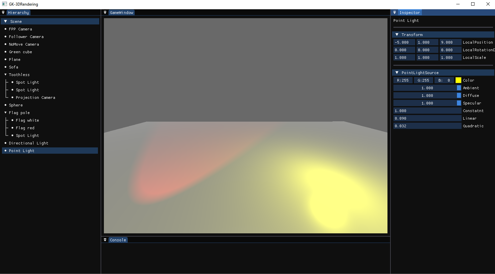

# Renderer3D  
Renderer3D is simple 3D rendering engine developed as part of Computer Graphics course at WUT. It's written in C# using OpenTK with OpenGL, and ImGUI.

## Features  
### Model  system
Engine includes few built-in meshes (e.g. Cube, Plane) and supports loading .obj models. Each model can change their material which consists of:  
- Color  
- Ambient coefficient  
- Diffuse coefficient  
- Specular coefficient  
- Shininess  

  

*Note: Texture support is not yet implemented.*

### Inspector  
Interactive inspector for manipulating object properties (position, rotation, scale), materials for mesh objects, and camera settings (like setting active camera) etc..

Powered by C# reflections, it automatically adapts to any component type. Special attributes modify property display:  
- **[InspectorIgnore]** - Skips drawing property  
- **[InspectorSlider\<T>(min, max)]** - Displays property as slider (must be type **T** supported by ImGui)  
- **[InspectorColor]** - Displays as color picker (must be OpenTK.Mathematics.Vector3)  

  

  

  

  

### Hierarchy  
Visual tree structure displaying all scene objects with selection support for the inspector.

  

### Lighting  
Phong lighting model implementation featuring **3** different light types:  
- **Point light** - Emits light in all directions from single point  
- **Spot light** - Cone of light with adjustable angles  
- **Directional light** - Global sun-like light with day/night cycle  animation

All light sources support color adjustment and coefficient settings (ambient/diffuse/specular). Point and spot lights support attenuation.
##### Spot light and point light, with directional light(day)

  

##### Spot light and point light, without directional light(night)

  

### Cameras  
Engine supports projection cameras with different behaviors:  
- **No-Move Camera** - Basic static camera  
- **Follower Camera** - Follows object with adjustable speed  
- **FPP Camera** - First-person controls:  
**W/S** - forward/backward  
** A/D** - left/right  
**Space/LShift** - up/down  
Hold **LMB** to rotate camera around  
##### FPP Camera

  

##### Follower Camera

  

##### Follower Camera with set speed

  

##### Camera attached to object

  

### Distance fog
Fog that increases with distance, helping maintain realistic environment.

  

### Tessellation Shader  
Specialized tessellation shader for rendering bicubic Bézier patches with wave animation.
 Tessellation level adjusts based on camera distance. Patches use the same material system. Waving animation supports adjustable animation speed. 
##### Example usage to make flag 

  

